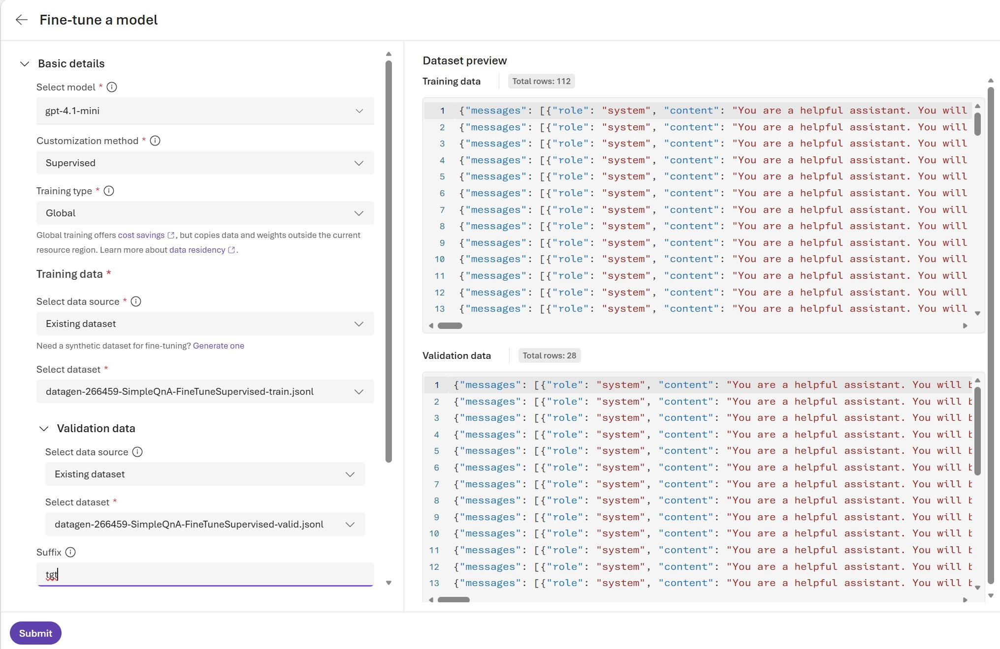
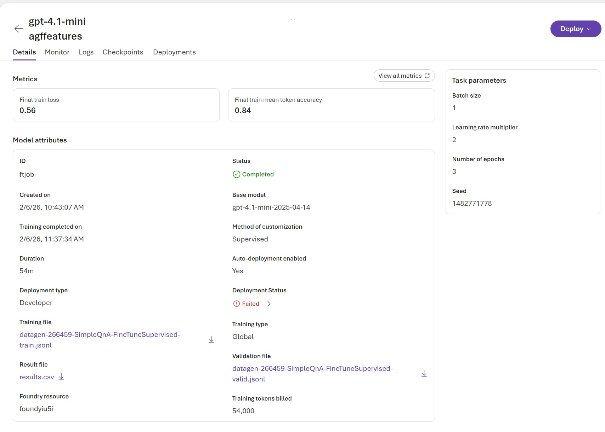
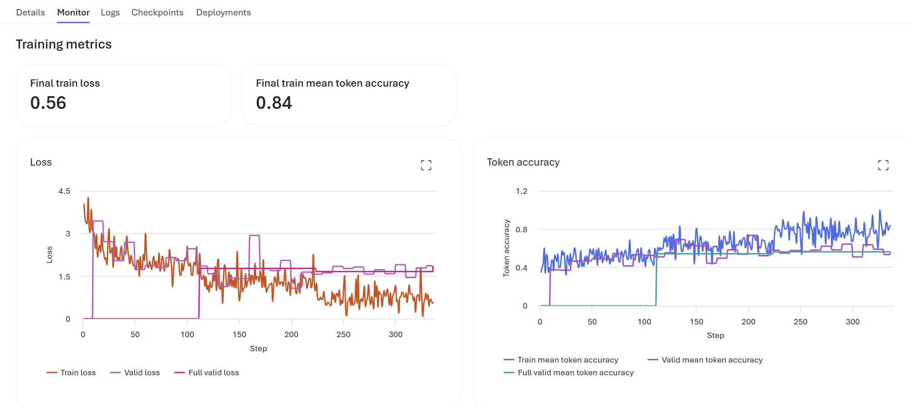
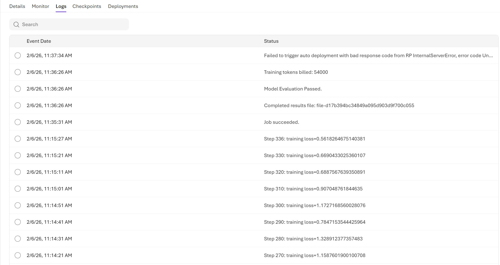
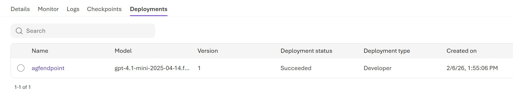
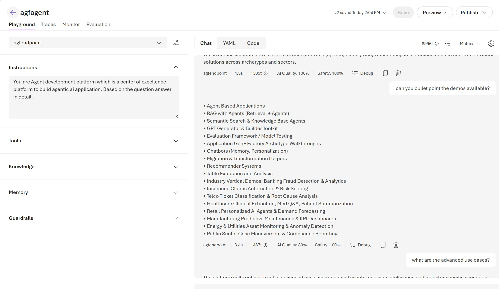
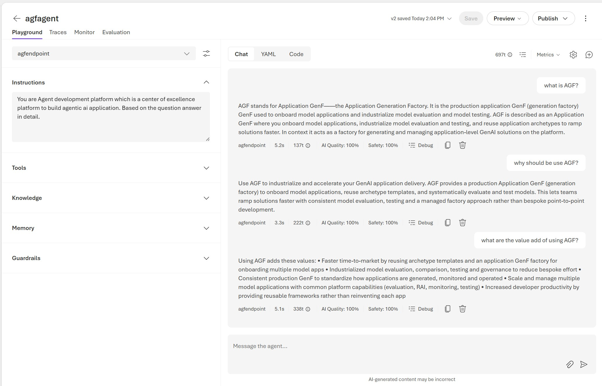
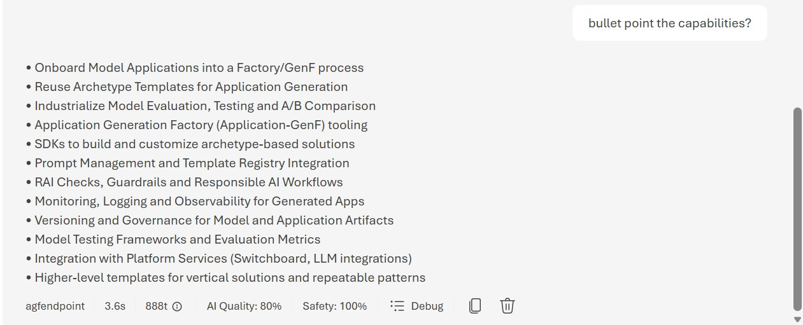
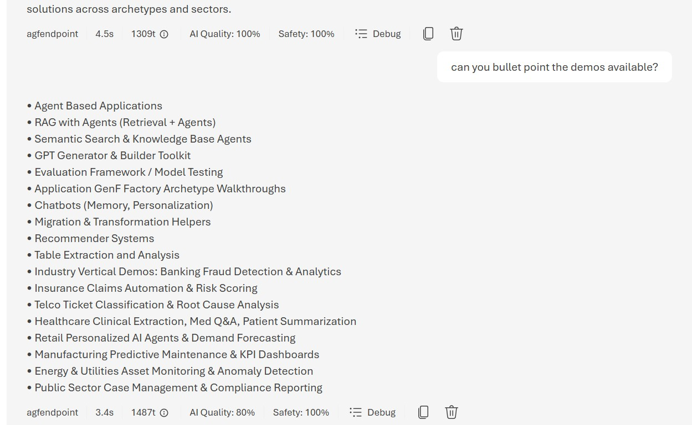

# Fine tune Gpt model with custom data in Foundry and Build a agent on top of it.

## Overview

- Idea here is to create a custom model for a agent to use.
- Based on a pdf file with details about Azure Gen AI Foundation, I generated synthetic data and fine tuned a gpt model in Foundry. Then I used that model to create a agent with Microsoft Agent Framework.
- My goal is to make the system learn what AGF which is Azure genai foundation platform.
- if i use general model, it might understand AGF has something different.
- So show case customizing to industry specific knowledge. In this case AGF specific knowledge.
- Here is for a CoE Platform built and ability to understand the platform and answer questions related to it. So that users can ask questions about the platform and get answers from the agent which has been fine tuned on AGF specific knowledge.

## Prerequisites

- Azure Subscription
- Microsoft Foundry workspace set up.
- I selected East us as region for Foundry workspace because it has the most capabilities available.
- PDF file to generate Synthentic Data for fine tuning. I used a AGF - Azure Gen AI Foundation presentation in pdf format. You can use any pdf file you want.

## Steps

- First create a synthetic data set from the PDF file.
- Go to Microsoft Foundry -> Data tab -> Create -> Synthetic Data
- Follow the steps in the image

- Fill the name and also the question types you want to generate.
- Select the PDF file as source.
- Upload the pdf file in the data sources if not already done.
- i am creating like 500 rows of synthetic data. Max is 1000 rows.
- Make sure there is validation split.
- Then click Create and wait for the synthetic data set to be created.

- now select the synthetic data set and click on use this data set for fine tuning.
- Then select gpt 4.1 mini model
- Customization method: Supervised Fine tuning
- Training type as Global
- Data set should be selected already.
- scroll to bottom and click on Developer for deployment type.
- on the right side you can view the training and validation data.
- Click Submit and wait for the fine tuning to complete.

- Once fine tuning is complete, go to the model deployments tab and deploy the fine tuned model.

- Check the training log and accuracy.

- if the deployment failed then click deploy again.
- Once deployed, note down the deployment name.

- Check the deployments

- Now let's navigate to agent creation using Microsoft Foundry UI.
- Go to Agents tab and click on Create agent.
- Give a name and select the fine tuned model deployment created earlier.

- now try some queries related to AGF.

## Conclusion

- validate the training data and fine tuning results.
- I did see some inconsistencies in the answers which means the fine tuning can be improved by improving the training data and also increasing the number of rows in the synthetic data set.
- But overall it was a good experience to see how to fine tune a model in Foundry and then use that fine tuned model to create an agent that can answer questions related to AGF - Azure Gen AI Foundation platform.