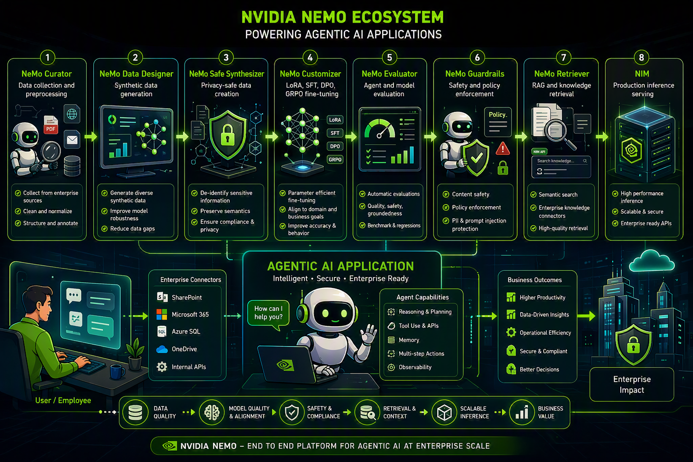

# The NVIDIA NeMo Ecosystem: A Blueprint for Enterprise-Grade Agentic AI

## How to build intelligent, secure, and production-ready AI agents at scale.

NVIDIA NeMo provides this end-to-end platform, offering a modular workflow designed to power "Agentic AI" applications that are intelligent, secure, and enterprise-ready.

## The Eight Pillars of the NeMo Ecosystem

The journey to a production-ready agent follows a structured eight-step process within the NeMo ecosystem:
- NeMo Curator: It starts with the data. This stage involves collecting information from enterprise sources, cleaning and normalizing it, and providing the necessary structure and annotation.
- NeMo Data Designer: To improve model robustness, this tool generates diverse synthetic data, helping to reduce data gaps that might exist in real-world datasets.
- NeMo Safe Synthesizer: Safety and privacy are paramount. This module ensures privacy-safe data creation by de-identifying sensitive information and ensuring compliance while preserving the original semantics.
- NeMo Customizer: Here is where the "intelligence" is fine-tuned. Using techniques like LoRA, SFT, DPO, and GRPO, developers can align the model to specific domain and business goals, significantly improving accuracy.
- NeMo Evaluator: Before deployment, agents must be vetted. This stage provides automatic evaluations of quality, safety, and groundedness—essential for building the trust we explored in our AgentIQ tutorial.
- NeMo Guardrails: This serves as the safety and policy enforcement layer. It protects against PII leaks, prompt injections, and ensures all content adheres to defined safety policies.
- NeMo Retriever: For advanced RAG (Retrieval-Augmented Generation), this module uses semantic search and enterprise connectors (like SharePoint and Azure SQL) to provide high-quality knowledge retrieval.
- NIM (NVIDIA Inference Microservices): Finally, the model is served in production. NIM provides high-performance, scalable, and secure inference via enterprise-ready APIs.

## The Heart of the System: The Agentic AI Application

At the center of this ecosystem is the Agentic AI Application itself. These agents are defined by five core capabilities:
- Reasoning & Planning: The ability to break down complex tasks.
- Tool Use & APIs: Interacting with external software and services.
- Memory: Retaining context across interactions.
- Multi-step Actions: Executing sequences of tasks to reach a goal.
- Observability: Providing transparency into the agent's "thought" process.

## Driving Business Value

By following this end-to-end platform approach, organizations can move past simple chatbots and achieve significant Business Outcomes. This includes higher productivity, better data-driven insights, and improved operational efficiency, all while remaining secure and compliant.
The shift from experimental AI to Enterprise Impact is only possible when you have a pipeline that ensures data quality, model alignment, and scalable inference. The NVIDIA NeMo ecosystem provides exactly that roadmap.