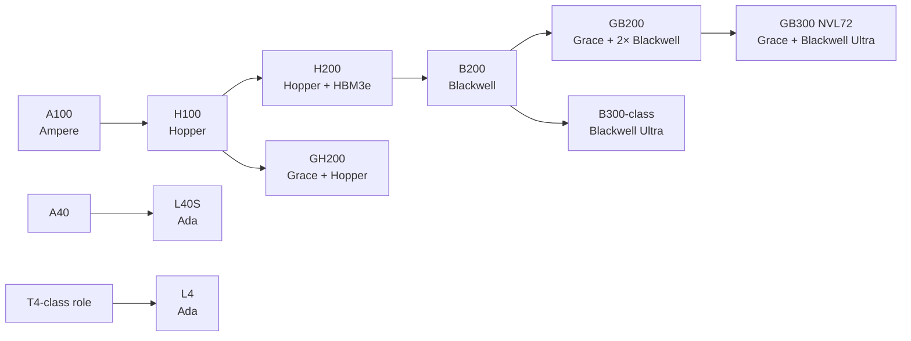
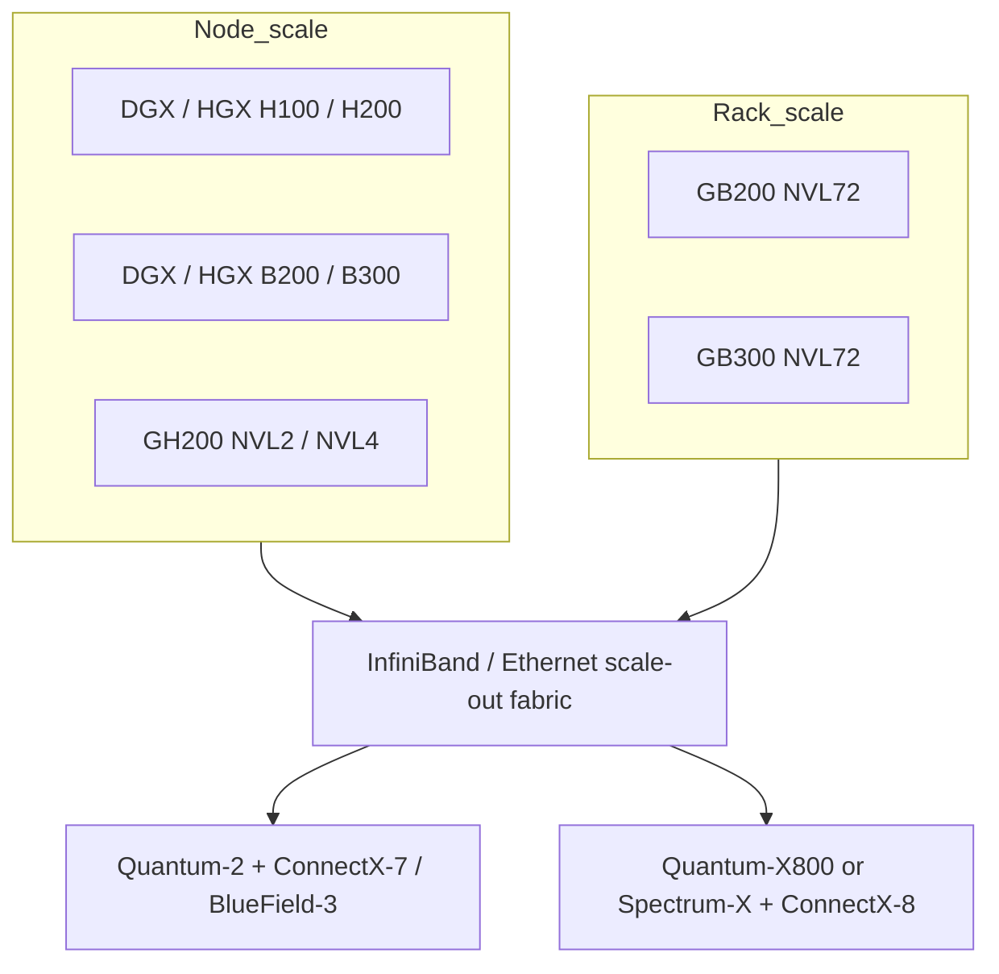

# NVIDIA AI Hardware Report

## Executive summary

NVIDIA’s **current public data center AI portfolio** is now led by **Blackwell Ultra and Blackwell rack- and node-scale systems**—notably **GB300 NVL72, GB200 NVL72, GB200 NVL4, HGX B300, HGX B200, GH200 NVL2/NVL4, HGX H200, and H200 NVL**—while the **universal graphics-and-compute** side is centered on **RTX PRO 6000 Blackwell Server Edition, L40S, and L4**. That is the clearest signal from NVIDIA’s current line card and current product pages. H100 and A100 still have live product pages and ongoing software support, but they no longer appear as the lead items on the current public line card, so the best description is **previous-generation but still actively usable / legacy-current**, not “front-line” portfolio centerpieces. citeturn8view0turn9view0turn9view1turn13view0turn5view0turn5view4

Technically, the clearest generation shifts are these. **A100** established the modern MIG-and-NVLink data center template on Ampere. **H100/H200** brought Hopper’s Transformer Engine and FP8, with **H200** keeping Hopper-class compute rates but expanding memory to **141 GB HBM3e** at **4.8 TB/s**, which materially improves large-model inference and memory-bound HPC. **Blackwell/Blackwell Ultra** then moved the design center toward **FP4/NVFP4**, larger NVLink domains, and rack-scale fabrics, with **GB200 NVL72** claiming **30x faster real-time trillion-parameter inference**, **4x training**, and **25x energy efficiency versus H100-based infrastructure**, while **GB300 NVL72** adds **1.5x more dense FP4 Tensor Core FLOPS**, **2x attention performance**, and up to **50x overall AI factory output versus Hopper-based platforms** in NVIDIA’s current framing. citeturn11view0turn11view2turn10view4turn5view1turn30view3turn31view0turn6view2

For procurement or platform planning, the practical divide is now straightforward. **H100/H200** remain strong general-purpose training and inference platforms, especially where existing HGX/DGX and ConnectX-7 / NDR400 infrastructure already exists. **B200/GB200/GB300/B300** are the accelerators to prioritize when the primary objective is **reasoning-heavy inference, very large-context models, expert-parallel MoE serving, and rack-scale AI-factory throughput**. **GH200** still occupies a differentiated niche where **CPU-GPU coherent memory**, **large unified fast memory**, and memory-heavy preprocessing or graph/data workloads matter as much as raw tensor throughput. **L40S** and **L4** remain the best fit when the goal is **air-cooled, PCIe-based, lower-friction enterprise inference / visualization / video / edge deployment** rather than maximum frontier-model throughput. citeturn5view1turn16view0turn30view3turn31view0turn11view1turn11view3

The biggest caveat in the public record is **single-GPU Blackwell Ultra disclosure**. NVIDIA’s public materials are much richer for **HGX B300** and **GB300 NVL72** than for a standalone **B300 GPU datasheet**. Likewise, some requested fields—especially **exact standalone B200/B300 HBM bandwidth, standalone B300 memory capacity, exact GH200 single-superchip FLOP tables, and public MSRP/list pricing**—are not cleanly exposed in the sources reviewed, so they are marked **unspecified** or explicitly labeled **inferred from NVIDIA platform totals** where arithmetic derivation is defensible. citeturn23view0turn31view0turn19search3

## Product comparison

The comparison below is split into a **hardware table** and an **enablement / positioning table** for readability. Together they form the full product comparison. Unless otherwise noted, NVIDIA’s published Tensor Core values are **with sparsity**. Any value marked **inferred** is arithmetic derived from NVIDIA’s own system totals rather than from a standalone chip datasheet. citeturn11view0turn11view2turn10view4turn11view1turn11view3turn30view1turn23view0

### Hardware comparison

| Product | Status in current public portfolio | Architecture | Process / transistor count | FP32 | TF32 | BF16 | FP16 | FP8 | INT8 | INT4 / FP4 | Memory and bandwidth | NVLink / NVSwitch / PCIe / C2C | Power / form factor | ECC / MIG | Sources |
|---|---|---|---|---:|---:|---:|---:|---:|---:|---:|---|---|---|---|---|
| **A100 80GB** | Prior-gen, still supported; not on current 2025 line card | Ampere GA100 | TSMC 7nm N7; **54.2B** | 19.5 TF | 156 / 312 TF | 312 / 624 TF | 312 / 624 TF | unspecified | 624 / 1248 TOPS | unspecified | 80GB HBM2e; **1,935 GB/s PCIe**, **2,039 GB/s SXM** | NVLink **600 GB/s**; PCIe Gen4 **64 GB/s**; NVSwitch on HGX A100 | 300W PCIe; 400W SXM, CTS up to 500W | ECC on A100 memory subsystem; MIG up to **7** | citeturn35view0turn37search1turn13view0turn38view0 |
| **L4** | Current universal accelerator | Ada Lovelace | 4N; transistor count **unspecified** | 30.3 TF | 120 TF | 242 TF | 242 TF | 485 TF | 485 TOPS | unspecified | 24GB GDDR6; **300 GB/s** | No NVLink; PCIe Gen4 x16 **64 GB/s** | 72W; HHHL single-slot PCIe | ECC enabled by default; no MIG published | citeturn11view3turn33view0turn13view0 |
| **L40S** | Current universal accelerator | Ada Lovelace | 4N-class Ada; transistor count **unspecified** for L40S page | 91.6 TF | 183 / 366 TF | 362.05 / 733 TF | 362.05 / 733 TF | 733 / 1,466 TF | 733 / 1,466 TOPS | 733 / 1,466 TOPS INT4 | 48GB GDDR6 with ECC; **864 GB/s** | No NVLink; PCIe Gen4 x16 **64 GB/s** | 350W; dual-slot passive PCIe | ECC listed; MIG **No** | citeturn32view0turn36view2turn13view0 |
| **H100 SXM** | Prior-gen, still active; not on current line card | Hopper GH100 | TSMC 4N; **80B** | 67 TF | 989 TF | 1,979 TF | 1,979 TF | 3,958 TF | 3,958 TOPS | unspecified | 80GB HBM3; **3.35 TB/s** | NVLink **900 GB/s**; PCIe Gen5 **128 GB/s**; NVSwitch in HGX/DGX | up to 700W configurable; SXM | HBM ECC/error-recovery features on 100-class GPUs; MIG up to **7** | citeturn11view2turn14search1turn14search9turn34search2turn38view0 |
| **H100 NVL** | Prior-gen, still active | Hopper GH100 | TSMC 4N; **80B** | 60 TF | 835 TF | 1,671 TF | 1,671 TF | 3,341 TF | 3,341 TOPS | unspecified | 94GB HBM3; **3.9 TB/s** | 2-way NVLink bridge **600 GB/s**; PCIe Gen5 **128 GB/s** | 350–400W configurable; dual-slot air-cooled PCIe | HBM ECC/error-recovery features on 100-class GPUs; MIG up to **7** | citeturn11view2turn14search1turn34search2turn38view0 |
| **H200 SXM** | Current Hopper flagship node accelerator | Hopper GH100 | TSMC 4N; **80B** | 67 TF | 989 TF | 1,979 TF | 1,979 TF | 3,958 TF | 3,958 TF | unspecified | 141GB HBM3e; **4.8 TB/s** | NVLink **900 GB/s**; PCIe Gen5 **128 GB/s**; NVSwitch in HGX H200 | up to 700W configurable; SXM | HBM ECC/error-recovery features on 100-class GPUs; MIG up to **7** | citeturn10view4turn14search1turn34search2turn38view0 |
| **H200 NVL** | Current Hopper PCIe / air-cooled enterprise SKU | Hopper GH100 | TSMC 4N; **80B** | 60 TF | 835 TF | 1,671 TF | 1,671 TF | 3,341 TF | 3,341 TF | unspecified | 141GB HBM3e; **4.8 TB/s** | 2- or 4-way NVLink bridge **900 GB/s per GPU**; PCIe Gen5 **128 GB/s** | up to 600W configurable; dual-slot air-cooled PCIe | HBM ECC/error-recovery features on 100-class GPUs; MIG up to **7** | citeturn10view4turn34search2turn38view0 |
| **GH200 Grace Hopper Superchip** | Current coherent-memory CPU+GPU accelerator | Grace + Hopper | Mixed package; Hopper GPU on TSMC 4N; superchip transistor total **unspecified** | unspecified | unspecified | unspecified | unspecified | unspecified | unspecified | unspecified | GPU memory: HBM3 / HBM3e; up to **144GB HBM3e** on later GH200; CPU memory up to **480GB LPDDR5X**; combined fast memory up to **624GB** | NVLink-C2C **900 GB/s**; GH200 NVL2 fully couples two superchips; GH200 NVL2 has **288GB HBM** and **10 TB/s** GPU-memory bandwidth | product-page form factor is integrated superchip / OEM module; TDP unspecified | MIG supported on “H100 on GH200” with max **7**; CC **9.0** | citeturn16view0turn17search4turn17search5turn17search10turn34search2 |
| **B200** | Current Blackwell GPU, though public data is mostly HGX/DGX-centered | Blackwell GB100 | TSMC 4NP; **208B** | **~75 TF** inferred from HGX B200 total | **~2.25 PF** inferred | **~4.5 PF** inferred | **~4.5 PF** inferred | **~9 PF** inferred | **unspecified** in retrieved standalone public source | **~18 / 9 PF FP4** inferred (sparse / dense) | **180GB HBM3E**; standalone bandwidth **unspecified** in retrieved standalone source | NVLink 5 GPU-to-GPU **1.8 TB/s**; NVSwitch 5; CC **10.0** | Public standalone TDP not found in retrieved sources; HGX/SXM-class | MIG supported, max **7** | citeturn5view6turn23view0turn34search1turn34search2 |
| **GB200 Grace Blackwell Superchip** | Current flagship Grace+Blackwell accelerator module | Grace + 2× Blackwell GB100 | Mixed package; GPU dies on TSMC 4NP; **2×208B GPU transistors plus CPU, inferred** | 160 TF | 5 PF | 10 PF | 10 PF | 20 PF | 20 POPS | 40 / 20 PF FP4 (sparse / dense) | **372GB HBM3E**, **16 TB/s**; CPU memory up to **480GB LPDDR5X**, up to **512 GB/s** | NVLink **3.6 TB/s**; NVLink-C2C to Grace; builds into NVL72 with **130 TB/s** rack NVLink domain | Superchip / rack module; standalone TDP unspecified | MIG supported, max **7**; CC **10.0** | citeturn30view1turn30view3turn34search2turn5view6 |
| **B300-class Blackwell Ultra GPU** | Current, but public disclosure is mainly platform-level via HGX B300 / GB300 NVL72 | Blackwell Ultra | Blackwell Ultra on Blackwell-family silicon; **208B** stated for Blackwell Ultra GPU | **~75 TF** inferred from HGX B300 total | **~2.25 PF** inferred | **~4.5 PF** inferred | **~4.5 PF** inferred | **~9 PF** inferred | **ambiguous / unspecified** in retrieved public sources | **~18 / 13.5 PF FP4** inferred (sparse / dense) | Platform pages imply **~288GB-class HBM3E**, but exact standalone capacity in retrieved source is **unspecified** | NVLink 5 GPU-to-GPU **1.8 TB/s**; NVSwitch 5; CC **10.3** | Public standalone TDP not found; HGX/SXM-class | MIG support for B300 not explicitly shown in retrieved MIG tables; **unspecified** | citeturn23view0turn31view0turn20search6turn13view0 |

### Enablement, software, positioning, and commercial notes

| Product | Compute capability / software stack notes | Target workloads | Immediate-predecessor view | Release / availability / price notes | Sources |
|---|---|---|---|---|---|
| **A100 80GB** | CC **8.0**; CUDA-X stack; MIG; NVLink / NVSwitch; widely supported in NVIDIA software ecosystem | Training, inference, analytics, HPC | Major jump over Volta; A100 page says up to **20x** prior-generation performance and partitioning into seven MIGs | Exact public launch date not re-verified here; current product page still live; public MSRP/list price **unspecified** | citeturn13view0turn5view4turn35view0 |
| **L4** | CC **8.9**; CUDA **12.0+** from L4 brief; SR-IOV 32 VFs; vGPU support | Edge and cloud inference, video, graphics, low-power data-center acceleration | Official direct predecessor in retrieved sources **unspecified** | Current public product page; MSRP/list price **unspecified** | citeturn13view0turn33view0turn5view3 |
| **L40S** | CC **8.9**; vGPU support; no MIG; NVIDIA AI Enterprise used in OVX / enterprise stacks | GenAI inference and training at moderate scale, rendering, Omniverse, enterprise AI | NVIDIA states up to **5x** higher inference performance than **A40** | Current public product page; MSRP/list price **unspecified** | citeturn13view0turn32view0 |
| **H100 SXM / NVL** | CC **9.0**; Transformer Engine; MIG; current CUDA-X / cuDNN / TensorRT-LLM ecosystem; H100 NVL includes NVIDIA AI Enterprise | Frontier training, mainstream enterprise LLM inference, HPC | H100 page claims up to **4x** higher GPT-3 training and up to **30x** inference vs prior generation; NVLink rises to **900 GB/s** on SXM | Product page live in 2026, but H100 is not on the current 2025 line card; public MSRP/list price **unspecified** | citeturn11view2turn13view0turn8view0 |
| **H200 SXM / NVL** | CC **9.0**; MIG; H200 NVL includes five-year NVIDIA AI Enterprise subscription | LLM inference, HPC, mainstream air-cooled enterprise racks | Same headline compute rates as H100, but much more memory; H200 page claims **1.9x** faster Llama2 70B inference, **1.6x** faster GPT-3 175B inference, and H200 NVL claims up to **1.7x** LLM inference and **1.3x** HPC over H100 NVL | Public page says **“Now available”**; public MSRP/list price **unspecified** | citeturn5view1turn10view4turn13view0 |
| **GH200** | CC **9.0** on the Hopper GPU side; runs NVIDIA AI Enterprise, HPC SDK, and Omniverse per GH200 page | Giant-memory AI/HPC, RAG preprocessing + vector search, GNNs, memory-heavy data processing | Distinct from H100/H200 because the key differentiator is coherent Grace+GPU memory; NVIDIA reports up to **30x** embedding-generation speedup and up to **8x** GNN training speedup vs H100 PCIe; GH200 NVL2 offers **3.5x** more GPU memory and **3x** more bandwidth than H100 in one server | GH200 page says **currently available**; public MSRP/list price **unspecified** | citeturn16view0turn17search5turn37search11 |
| **B200** | CC **10.0**; MIG support published; Blackwell software features emphasize TensorRT-LLM, NVFP4, and workload-aware power profiles | Largest-scale training and inference, especially MoE and reasoning workloads | Public direct comparisons are mostly platform-level: GB200 NVL72 claims **30x** real-time inference, **4x** training, and **25x** energy efficiency vs H100-based infrastructure | Current Blackwell generation; standalone public pricing **unspecified** | citeturn13view0turn34search1turn30view3turn24search3 |
| **GB200** | CC **10.0**; MIG supported; full Grace+Blackwell coherent-memory stack | Rack-scale LLM inference and training, especially trillion-parameter and MoE deployments | Succeeds GH200 conceptually, but NVIDIA’s public deltas are mostly vs **H100** infrastructure rather than GH200 | Current flagship Blackwell system module; public MSRP/list price **unspecified** | citeturn30view1turn30view3turn34search2 |
| **B300-class Blackwell Ultra** | CC **10.3** on B300 / GB300; software emphasis on reasoning inference, NVFP4, TensorRT-LLM, Dynamo, ConnectX-8 scale-out | Agentic AI and reasoning, long-context inference, high-throughput video/world-model generation | NVIDIA states **1.5x** more dense FP4 Tensor Core FLOPS and **2x** higher attention performance than Blackwell; platform pages also state **1.5x larger HBM3E memory** | Public availability is clearest at the **GB300 NVL72** level, which is marked **Available Now**; standalone B300 public list price **unspecified** | citeturn31view0turn6view2turn13view0 |

### Portfolio evolution

This diagram reflects the architectural progression visible across NVIDIA’s current product pages and line-card framing: **Ampere → Hopper / Grace Hopper → Blackwell / Grace Blackwell → Blackwell Ultra**. citeturn8view0turn11view2turn10view4turn16view0turn30view3turn31view0

## Improvements over predecessors

The cleanest **single-device** generational improvement is **H200 over H100**. H200 keeps essentially the same peak Hopper compute table as H100, but expands memory from **80 GB to 141 GB** on SXM and from **94 GB to 141 GB** on NVL, while raising memory bandwidth to **4.8 TB/s**. That is roughly **1.76x** the H100 SXM capacity and about **1.43x** the H100 SXM bandwidth. NVIDIA’s own page then turns that memory increase into application signals: up to **1.9x faster** Llama2 70B inference, **1.6x faster** GPT-3 175B inference, and, for H200 NVL specifically, up to **1.7x** LLM inference and **1.3x** HPC over H100 NVL. citeturn11view2turn10view4turn5view1

The largest **architecture-level** step from Ampere to Hopper is **H100 over A100**. Publicly available spec tables show **FP32** rising from **19.5 TFLOPS** on A100 80GB to **67 TFLOPS** on H100 SXM, **TF32** from **312 TFLOPS** with sparsity to **989 TFLOPS**, and **BF16 / FP16** from **624 TFLOPS** with sparsity to **1,979 TFLOPS**. H100 also introduces **FP8** on-product, whereas A100’s official specs do not publish FP8 at all. Memory bandwidth climbs from **2.039 TB/s** on A100 SXM to **3.35 TB/s** on H100 SXM, and GPU-to-GPU NVLink rises from **600 GB/s** to **900 GB/s**. NVIDIA’s H100 page further claims up to **4x higher GPT-3 training** and up to **30x higher inference** than the prior generation in selected workloads. citeturn35view0turn11view2turn5view0

**GH200** is less about pure tensor-ratio uplift and more about **memory topology**. Its defining change versus regular PCIe CPU+GPU servers is the **900 GB/s coherent NVLink-C2C** fabric and the much larger coherent fast-memory pool, with up to **480 GB LPDDR5X + 144 GB HBM3e** in newer GH200 configurations. NVIDIA’s published application deltas therefore read very differently from H200’s: up to **36x** faster data processing, **30x** faster embedding generation for RAG preprocessing, and up to **8x** GNN training relative to an H100 PCIe-based baseline in the examples shown. For users whose bottleneck is host-device data motion or oversubscription pressure rather than raw tensor math, GH200 remains strategically distinct even after H200 arrived. citeturn16view0turn17search5turn37search11

**Blackwell over Hopper** is the largest system-level shift in the report. The **GB200 NVL72** page positions Blackwell’s leap not as a modest per-GPU bump but as a **rack-scale scaling reset**: a **72-GPU NVLink domain**, **130 TB/s** rack NVLink bandwidth, **30x faster real-time trillion-parameter inference**, **4x LLM training**, and **25x energy efficiency versus H100-based infrastructure**. It also shifts the precision strategy downward with **FP4 / NVFP4**, which is now central to the way NVIDIA talks about inference economics. That same transition is what makes the **B200** and especially the **GB200** more compelling for MoE and reasoning workloads than H100/H200 when software is aligned to TensorRT-LLM / Dynamo / NVFP4. citeturn30view3turn30view1turn24search5

**Blackwell Ultra over Blackwell** is a narrower but still highly material improvement. NVIDIA’s Blackwell Ultra messaging is explicit: **1.5x more AI compute FLOPS**, **2x attention-layer acceleration**, and **1.5x larger HBM3E memory** than Blackwell. At the system level, the **GB300 NVL72** page translates that into product outcome language: **10x** better user responsiveness, **5x** better throughput per megawatt, and up to **50x overall AI factory output performance versus Hopper-based platforms** for reasoning-oriented inference. That is the strongest evidence that NVIDIA’s near-term roadmap is optimizing not just for training throughput but for **token factory economics**, especially long-context and agentic inference. citeturn6view2turn31view0

On the lower-power / PCIe side, **L40S over A40** is straightforward: NVIDIA states up to **5x higher inference performance** than A40, while adding **FP8** support and keeping an enterprise-friendly passive PCIe form factor. **L4** is aimed lower in power and smaller in footprint, trading peak throughput for a **72W** envelope and a universal video / AI / graphics positioning that makes sense where rack density, thermals, and deployment simplicity matter more than absolute model size. citeturn32view0turn11view3

## Systems and networking

The single most important system distinction in NVIDIA’s current portfolio is the split between **node-scale HGX / DGX** designs and **rack-scale NVL72** designs. **HGX H100 / H200 / B200 / B300** are still the canonical eight-GPU building blocks. But **GB200 NVL72** and **GB300 NVL72** push the architecture boundary outward: instead of “eight GPUs in a box,” they expose a **single rack as the scale-up domain**, with **72 GPUs** in one NVLink domain and **130 TB/s** of low-latency GPU communication in the GB200/GB300 class. That changes model-parallel, expert-parallel, and low-latency reasoning economics in a way that ordinary multi-node InfiniBand clusters do not fully replicate. citeturn30view3turn31view0

For classic DGX/HGX deployments, NVIDIA’s own reference architectures remain strongly shaped by **ConnectX-7** and **NDR400 InfiniBand**. The current DGX BasePOD reference says that **DGX B200, DGX H200, and DGX H100** systems use **eight compute connections per node running at NDR400**, and the DGX/BasePOD documents identify **ConnectX-7** as the accelerator-side networking adapter family for H100/H200/B200 systems, with **BlueField-3** also integrated on DGX B200. That means Hopper and first-wave Blackwell still fit naturally into the mature NDR400 InfiniBand stack for scale-out training clusters. citeturn28search0turn28search9turn7search8

By contrast, the **GB300/GB200 NVL72** generation is explicitly paired with **Quantum-X800 InfiniBand** or **Spectrum-X Ethernet** plus **ConnectX-8 SuperNICs**. NVIDIA’s network docs describe Quantum-X800 as the next-generation InfiniBand platform for trillion-parameter AI, delivering **800 Gb/s end-to-end connectivity**, while the NVL72 enterprise reference architecture says each GB300 tray carries **four dual-port ConnectX-8 SuperNICs**, and each ConnectX-8 provides up to **800 Gb/s** of low-latency connectivity for GPU traffic. In other words, the scale-up domain got much larger inside the rack, but NVIDIA simultaneously doubled down on higher-bandwidth scale-out to keep multi-rack fabrics efficient. citeturn28search2turn28search5turn28search4turn31view0

The current line card also reveals an important portfolio planning heuristic. NVIDIA pairs **GB300 NVL72, GB200 NVL72, HGX B300, and HGX B200** with **QTM-X800 / SPTMX**, meaning **Quantum-X800 InfiniBand** or **Spectrum-X Ethernet**, while **HGX H200, H200 NVL, GH200 NVL2/NVL4, L40S, and L4** are framed around **Quantum-2 / Spectrum-X / Spectrum-3-era** fabrics. That is a concise public statement that NVIDIA sees the **Blackwell / Blackwell Ultra era** as closely tied to its next-generation fabric stack, not just to faster GPUs. citeturn8view0turn9view0turn9view1

A useful way to think about the current system landscape is this:

This reflects NVIDIA’s own public segmentation: Hopper-era and early Blackwell platforms are still comfortable in the **ConnectX-7 / NDR400 / Quantum-2** world, while **GB300-class AI factories** are increasingly co-designed around **ConnectX-8 and Quantum-X800 / Spectrum-X**. citeturn28search0turn28search2turn28search4turn31view0

## Benchmark evidence

The most credible cross-generation public benchmark source remains **MLPerf / MLCommons**, supplemented by NVIDIA’s own technical posts that map specific systems to the official submissions. On **MLPerf Inference v4.1**, NVIDIA reported that **H200** submissions delivered up to **1.5x** more performance than H100 submissions, while the first Blackwell submission delivered up to **4x** more performance on **Llama 2 70B** than H100. That result is important because it shows the progression in two steps: H200 improved Hopper mostly through memory, then Blackwell changed the scaling curve more aggressively. citeturn27search0

On **MLPerf Inference v5.0**, NVIDIA reported that **GB200 NVL72** delivered up to **3.4x higher per-GPU performance** on **Llama 3.1 405B** compared with an eight-GPU H200 system. On **MLPerf Training v5.0**, NVIDIA reported that the **GB200 NVL72** platform achieved up to **2.6x higher per-GPU performance** than Hopper, including a **2.2x** speedup on **Llama 3.1 405B pretraining** and **2.5x** on **Llama 2 70B LoRA fine-tuning**. MLCommons’ own write-up for Training v5.0 confirms the significance of that round and the introduction of the newer Llama benchmark. citeturn27search8turn27search5turn26search1

For the newest benchmark round, NVIDIA’s public MLPerf page says the platform delivered leading performance with **Blackwell and Blackwell Ultra**, including **GB300 NVL72** and **GB200 NVL72**, while **MLCommons Inference v6.0** describes the release as the most significant update to date, adding modern workloads such as **GPT-OSS 120B**, **vision-language models**, **text-to-video**, and **YOLOv11**. Even without reproducing every result row here, the directional conclusion is clear: NVIDIA’s latest public benchmark posture is no longer centered on “Hopper wins inference,” but on **Blackwell / Blackwell Ultra as the benchmark-leading generation** for both training and inference. citeturn24search8turn26search3

NVIDIA’s product-performance posts also add useful, workload-specific color beyond MLPerf. NVIDIA’s October 2024 H200 post reported **1.5x higher throughput** for **Llama 3.1 405B** when using pipeline parallelism instead of tensor parallelism on HGX H200, and a **1.2x** speedup on an H100 MLPerf Llama 2 70B benchmark from software improvements alone. That matters because it shows that part of the current performance story is **software maturation**, not just silicon. NVIDIA’s January 2026 MoE post likewise says recent TensorRT-LLM optimizations delivered up to **2.8x throughput increases per Blackwell GPU in three months**, reinforcing the same point. citeturn27search6turn20search3

For a more independent perspective, **Phoronix**’s GH200 testing is mostly on the **Grace CPU side**, not on full tensor-GPU benchmarking, but it is still useful because it validates the practical value of the Grace memory subsystem and Arm CPU design in real Linux workloads. Phoronix characterized the GH200 CPU subsystem as competitive with contemporary AMD EPYC and Intel Xeon single-socket servers, which is consistent with NVIDIA’s design thesis for coherent Grace + GPU systems: they are not only accelerators, but tightly integrated heterogeneous compute nodes. citeturn26search2turn29search12

## Open questions and limitations

A few items remain genuinely incomplete in the public sources reviewed. The biggest ones are **standalone B300 chip-level specs**, **exact standalone B200 and B300 HBM bandwidth**, **exact single-superchip GH200 FLOP tables**, and **public MSRP / list pricing** for virtually all of these products. NVIDIA’s recent public materials are much more detailed at the **HGX / DGX / NVL72 system level** than at the bare-chip level for Blackwell Ultra in particular, so some requested fields had to be marked **unspecified**. citeturn23view0turn31view0turn19search3

There is also a product-status ambiguity around **B100**. NVIDIA’s March 2024 Blackwell platform launch clearly established the Blackwell family publicly, but the **current CUDA compute-capability table** highlights **B200 / GB200** and **B300 / GB300**, and the **current line card** likewise centers on **B200 / B300 / GB200 / GB300** rather than B100. On that basis, the most rigorous conclusion is that **B100 was historically part of the Blackwell launch narrative, but its current public status as a lead shipping data-center SKU is unclear in the sources reviewed here**. citeturn22search0turn13view0turn8view0

Finally, “current” itself needs nuance. NVIDIA’s present portfolio framing clearly emphasizes **Blackwell Ultra / Blackwell / Grace Hopper / H200**, but the continued presence of **H100** and **A100** product pages, CUDA support, and MIG documentation means those parts are still operationally relevant for procurement, capacity planning, and software support. In practice, that makes them **legacy-current** rather than obsolete. citeturn5view0turn5view4turn13view0turn34search2