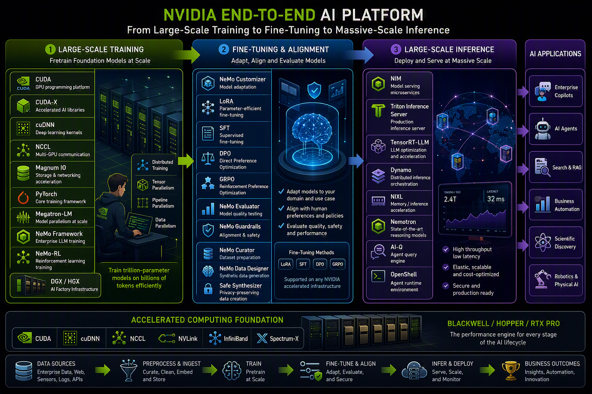

# From Data to Deployment: Navigating the End-to-End AI Model Building Lifecycle

Building modern AI is no longer just about writing a few lines of code; it is an industrial-scale process requiring a massive, integrated stack of hardware and software. According to the NVIDIA End-to-End AI Platform workflow, the journey from raw data to a production-ready AI application follows a rigorous three-phase pipeline: Large-Scale Training, Fine-Tuning & Alignment, and Massive-Scale Inference

## Phase 1: Large-Scale Training (The AI Factory)

The process begins with pretraining foundation models at scale. To handle trillion-parameter models trained on billions of tokens, developers utilize "AI Factory" infrastructure like DGX or HGX systems.
This stage relies on a deep software stack to manage complexity:
- Acceleration Libraries: CUDA, cuDNN, and NCCL provide the foundational kernels and communication protocols for multi-GPU setups.
- Parallelism Techniques: To fit massive models across many GPUs, the platform employs Tensor, Pipeline, and Data parallelism via frameworks like Megatron-LM and the NeMo Framework.
- Storage & Networking: High-speed data movement is facilitated by Magnum IO, ensuring that the GPUs are never starved of data during the intensive training process.

## Phase 2: Fine-Tuning & Alignment (The Customization Lab)

Once a foundation model is trained, it must be adapted to specific domains and aligned with human preferences. This phase is about adapting, aligning, and evaluating models to ensure they are safe and performant.
Key methodologies used here include:
- Efficient Adaptation: Techniques like LoRA (Low-Rank Adaptation) and SFT (Supervised Fine-Tuning) allow for precise adjustments without retraining the entire model.
- Preference Optimization: Methods such as DPO (Direct Preference Optimization) and GRPO (Reinforcement Preference Optimization) are used to align the model’s behavior with specific policies.
- Data Preparation & Safety: Tools like NeMo Curator and NeMo Guardrails ensure the datasets are clean and the resulting model remains within safe operational boundaries.

## Phase 3: Large-Scale Inference (The Production Engine)

The final stage is deploying and serving at massive scale. The goal here is high throughput and low latency, often measured in thousands of tokens per second with millisecond response times.
The inference stack includes:
- NIM (Model Serving Microservices): Standardized containers for deploying models efficiently.
- Optimization Engines: TensorRT-LLM provides specific optimizations for Large Language Models, while the Triton Inference Server manages production-level serving.
- Reasoning & Orchestration: Advanced agents can be built using Nemotron reasoning models and the OpenShell runtime environment.

## The Foundation: Accelerated Computing

Supporting this entire lifecycle is the Accelerated Computing Foundation, featuring Blackwell, Hopper, and RTX PRO architectures. This hardware layer is interconnected by high-bandwidth technologies like NVLink, InfiniBand, and Spectrum-X, providing the performance engine necessary for every stage—from the first data byte ingested to the final business outcome delivered.
By following this structured path—Preprocess, Train, Fine-Tune, and Infer—organizations can transform raw data into enterprise-grade AI applications such as AI Agents, Search & RAG (Retrieval-Augmented Generation), and autonomous robotics.